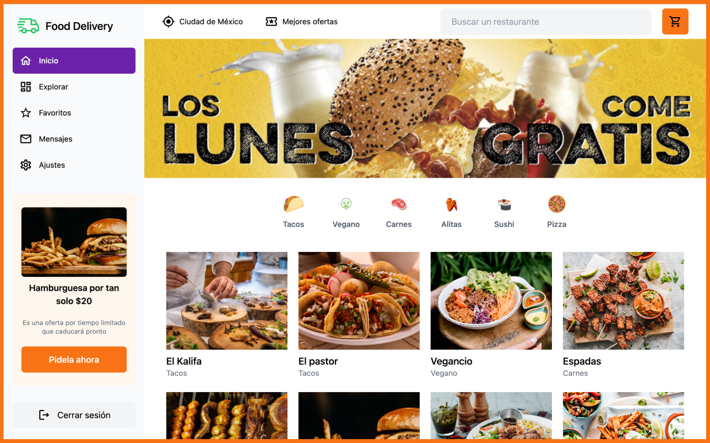

<div align="center">
  <h1>React Food Delivery</h1>


  <p>Food delivery application based on the concept of uber eats and rappi. In which you can register as a customer, owner or delivery person and depending on your profile you can register your restaurant for the sale of food, help deliver orders and order what you like the most.</p>
</div>

### Preview



## Features

- Notifications when:
  - there is an order
  - the order has been taken, cooked and delivered
- Multiple role management
- Email verification upon registration
- User location for food delivery
- Trace routes using mapbox
- Restaurants CRUD, reports and statistics
- Paypal payments to promote a restaurant

## Installation

To clone and run this application, you'll need [Git](https://git-scm.com) and
[Node.js](https://nodejs.org/en/download/) installed on your computer. _Optional_ you can install
[Yarn](https://yarnpkg.com/getting-started/install).

From your command line:

```bash
# Clone this repository
$ git clone https://github.com/harshaank/react-food-delivery.git

# Go into the repository
$ cd react-food-delivery

# Install dependencies
$ yarn install

# Run the app
$ yarn run start
```

**Note: This project has a backend made with nest.js, which you can configure to handle data
persistence, authentication, mailing, notifications, and more. The repository can be found at the
following link: [food-delivery-backend](https://github.com/harshaank/food-delivery-backend).**

## Deployment

It correctly bundles React in production mode and optimizes the build for the best performance.

```bash
$ yarn run build
```

## Tests

```bash
# Run unit tests
$ yarn run test

# View project test percentage
$ yarn run test:coverage

# e2e tests
$ yarn run cypress open
```

## Dependencies

The [mapbox-gl](https://docs.mapbox.com/mapbox-gl-js/api/) library is used to create maps. It is
necessary to have a [mapbox account](https://account.mapbox.com/) to be able to generate the token
that we need for said library.

## License

Released under the [MIT licensed](LICENSE).\
Feel free to fork this project and improve it. Give a ⭐️ if you like this project!
